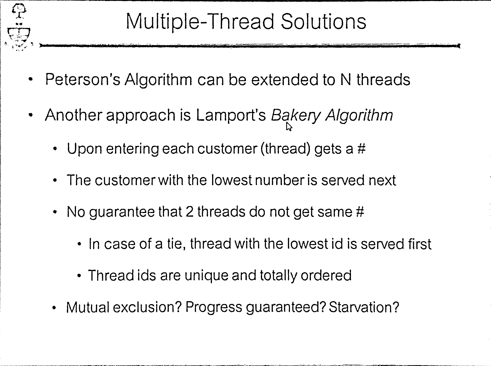

# PyScanner-Simple-Scanner
Followed Guidelines from [here](https://www.pyimagesearch.com/2014/09/01/build-kick-ass-mobile-document-scanner-just-5-minutes/).

This application takes an image like this …

… and turns it into this ….
 
